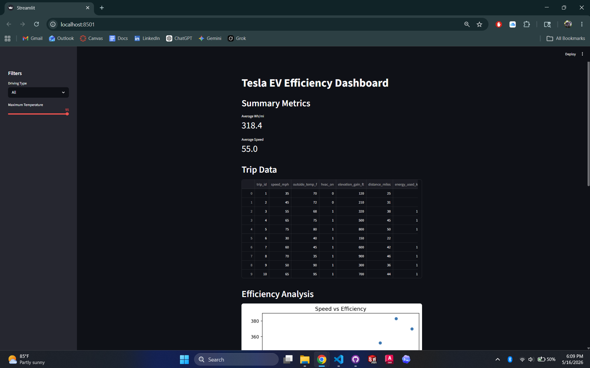

# ev-efficiency-analysis

# EV Efficiency Analysis Dashboard

## Overview

This project analyzes Tesla EV driving data using Python, Pandas, Matplotlib, and Streamlit.

The dashboard allows users to:
- analyze EV efficiency
- filter trips by driving type
- explore temperature effects
- visualize efficiency trends interactively

---

## Tools Used

- Python
- Pandas
- Matplotlib
- Streamlit
- Jupyter Notebook
- GitHub

---

## Features

- Interactive dashboard
- Speed vs efficiency analysis
- Temperature filtering
- Highway vs city filtering
- Efficiency distribution histogram
- Engineering findings section

---

## Dashboard Preview



---

## Engineering Findings

- Higher speeds generally increased Wh/mi.
- Highway driving conditions reduced efficiency.
- HVAC and temperature likely affect energy consumption.
- Elevation gain appears correlated with higher energy usage.

---

## Project Structure

```text
ev-efficiency-analysis
│
├── dashboard
├── data
├── graphs
├── notebook
└── README.md